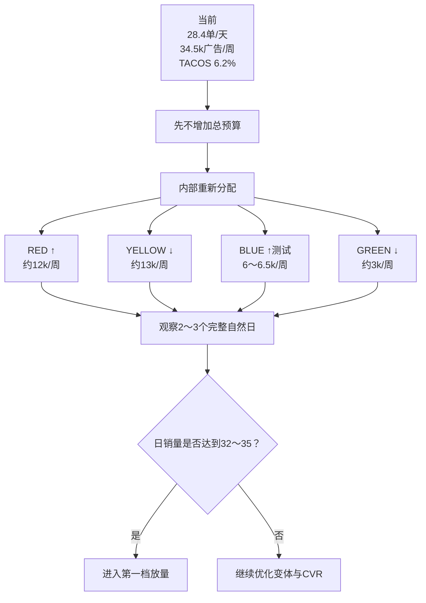
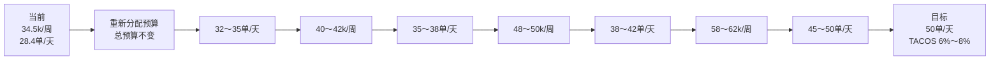
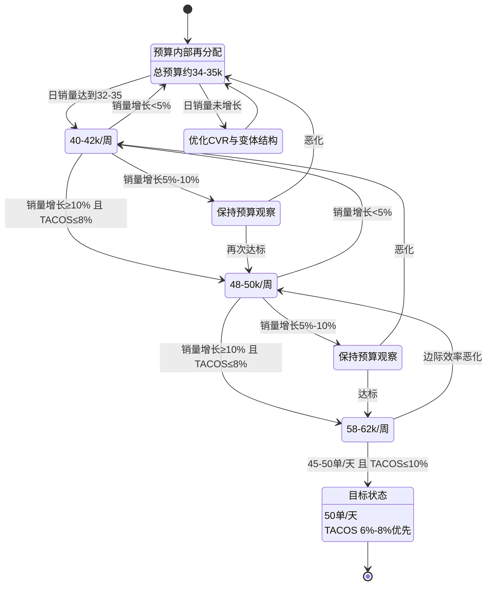

# GJYB001 系列：50单/天 + TACOS≤10% 放量策略

> 数据周期：2026-08-31 ～ 2026-09-06  
> 系列：GJYB001  
> SKU 数量：4  
> 数据依据：用户提供的 Ozon 广告系列 JSON  
> 说明：源文件逐日广告与销售状态均标记为 `partial`；广告订单不等于总销量，不能用总销量减广告订单推算自然销量。以下策略仅依据文件支持的数据与由其直接计算出的指标。

---

# 1. 当前状态

## 系列汇总

- 7天总销量：**199件**
- 日均销量：**约28.4件/天**
- 总销售额：**557,612 ₽**
- 广告费：**34,546.94 ₽**
- 广告销售额：**160,488 ₽**
- 广告订单：**57**
- CTR：**2.59%**
- CPC：**7.45 ₽**
- CVR：**1.23%**
- CPA：**606.09 ₽**
- ACOS：**21.53%**
- TACOS：**6.20%**
- ROAS：**4.65**

## 核心判断

> **当前系列并不缺广告预算空间，真正缺的是能够稳定承接新增广告的高效率流量。**

现阶段从约28单/天推到50单/天，不建议直接整体暴力加预算，而应：

```text
先优化预算结构
↓
让高效率变体承接更多预算
↓
再逐级增加总预算
↓
每一级都验证销量增量与TACOS
```

---

# 2. 50单/天目标倒推

当前平均每件销售额：

```text
557,612 ÷ 199 ≈ 2,802 ₽
```

目标：

```text
50件/天 × 7天
= 350件/周
```

对应周销售额约：

```text
350 × 2,802
≈ 980,700 ₽/周
```

---

# 3. 不同TACOS下的广告预算空间

| TACOS | 50单/天时对应周广告费 |
|---:|---:|
| 6% | ≈58,800 ₽ |
| 7% | ≈68,700 ₽ |
| 8% | ≈78,500 ₽ |
| 10% | **≈98,100 ₽** |

## 关键理解

> **98,000 ₽/周是50单/天、TACOS 10%时的理论红线，不是建议直接使用的预算目标。**

更合理的增长区间：

```text
正常增长：TACOS 6%～8%
激进冲量：TACOS 8%～10%
停止线：TACOS >10%
```

---

# 4. 四个变体当前表现

| 变体 | 广告费 | CVR | CPA | ACOS | TACOS | 当前定位 |
|---|---:|---:|---:|---:|---:|---|
| RED | 8,983.95 ₽ | **1.59%** | **449.20 ₽** | **15.97%** | 7.43% | 主力承接增量 |
| BLUE | 4,493.91 ₽ | 1.02% | 561.74 ₽ | 19.73% | **3.56%** | 第二增长点测试 |
| YELLOW | **16,173.71 ₽** | 1.32% | 646.95 ₽ | 22.98% | 8.17% | 预算偏重，先降后优化 |
| GREEN | 4,895.37 ₽ | **0.57%** | **1,223.84 ₽** | **44.20%** | 4.35% | 明显低效，优先缩量 |

---

# 5. 当前预算结构问题

## 现状

YELLOW 消耗：

```text
16,173.71 ₽
```

约占系列广告费：

```text
≈46.8%
```

但其广告效率并不是最优。

而 RED：

- ACOS 最低
- CVR 最高
- CPA 最低
- ROAS 最高

因此：

> **当前不是总预算绝对不足，而是预算分配效率不够高。**

---

# 6. 第一阶段：先不增加总预算

当前周广告费：

```text
≈34,500 ₽
```

先进行内部预算再分配。

## 建议测试结构

### RED

```text
约12,000 ₽/周
```

目的：

- 让当前效率最好的变体承接更多增量；
- 测试RED是否还能保持ACOS与CVR。

---

### YELLOW

```text
约13,000 ₽/周
```

从当前16k适当回调。

目的：

- 降低低效率边际流量；
- 看CPC能否回落；
- 看CVR能否重新提升。

---

### BLUE

```text
约6,000～6,500 ₽/周
```

目的：

- 保持小规模测试；
- 寻找第二个增长点。

---

### GREEN

```text
约3,000 ₽/周
```

目的：

- 明显缩量；
- 保留最低测试流量；
- 避免继续消耗低效率预算。

---

# 7. 第一阶段目标

总广告费仍保持：

```text
约34k～35k/周
```

但目标日销量：

```text
28.4单/天
↓
32～35单/天
```

如果同样的预算通过重新分配就能增加总销量，说明：

> **预算结构优化有效。**

---

# 8. 第一阶段决策导图



---

# 9. 第二阶段：第一档放量

如果预算重新分配后：

```text
日销量达到32～35单
```

则总预算：

```text
35k
↓
40～42k/周
```

增幅：

```text
约 +15%～20%
```

目标：

```text
32～35
↓
35～38单/天
```

---

# 10. 第一档放量通过条件

建议同时满足：

## 销量增长

```text
预算 +15%～20%
```

对应：

```text
日销量至少 +10%左右
```

---

## TACOS

```text
≤8%
```

---

## CVR

当前：

```text
1.23%
```

建议：

```text
至少不继续下降
最好 ≥1.3%
目标 ≥1.5%
```

---

## CPA

不应随着预算增长出现明显恶化。

---

# 11. 第三阶段：第二档放量

如果40～42k/周仍然有效：

```text
40～42k
↓
48～50k/周
```

目标日销量：

```text
38～42单/天
```

判断逻辑：

```text
预算增加约20%
↓
销量增长≥10%
↓
TACOS仍≤8%
↓
继续下一档
```

如果：

```text
预算增加20%
但销量只增加<5%
```

则：

> **边际流量开始失效，应退回上一稳定档位。**

---

# 12. 第四阶段：冲击50单/天

如果50k/周仍然有效：

```text
48～50k
↓
58～62k/周
```

目标：

```text
45～50单/天
```

每天广告费约：

```text
8,300～8,900 ₽/天
```

如果50单/天时平均每件仍约2,800 ₽：

```text
日GMV ≈ 140,000 ₽
```

假设：

```text
周广告费 ≈60,000 ₽
```

则日广告费：

```text
≈8,570 ₽
```

TACOS：

```text
8,570 ÷ 140,000
≈6.1%
```

即：

> **理论上不需要接近10% TACOS，就可能达到50单/天。**

---

# 13. 完整预算爬坡路径



---

# 14. TACOS控制规则

## 正常增长区

```text
TACOS ≤8%
```

可以继续观察增长。

---

## 激进冲量区

```text
8% < TACOS ≤10%
```

只能短期允许。

必须同时满足：

- 总销量继续增长；
- 新增广告预算仍能产生有效销量；
- CPA没有明显失控。

---

## 停止线

```text
TACOS >10%
```

如果连续出现：

```text
TACOS >10%
+
销量没有明显增长
```

则：

> **立即停止继续加预算并回退上一档。**

---

# 15. 软件化放量算法

## Step 1：计算基准销量

```text
BaselineUnits
= 最近3个完整自然日日均销量
```

---

## Step 2：增加预算

```text
BudgetNew
= BudgetOld × 1.15～1.20
```

---

## Step 3：观察

观察：

```text
2～3个完整自然日
```

---

## Step 4：计算销量增长率

```text
SalesGrowth
= 新3日均销量 / 原3日均销量 - 1
```

---

## Step 5：判断

### 继续放量

如果：

```text
SalesGrowth ≥10%
AND TACOS ≤8%
```

则：

```text
继续增加一级预算
```

---

### 保持观察

如果：

```text
5% ≤ SalesGrowth < 10%
AND TACOS ≤10%
```

则：

```text
保持当前预算
继续观察
```

---

### 回退

如果：

```text
SalesGrowth <5%
```

则：

```text
回退上一稳定预算
```

---

### 强制停止

如果：

```text
TACOS >10%
AND 销量没有明显增长
```

则：

```text
停止放量
回退预算
```

---

# 16. 放量状态机



---

# 17. 变体角色分工

## RED

```text
角色：第一增长引擎
```

当前：

- CVR：1.59%
- CPA：449 ₽
- ACOS：15.97%

策略：

> **优先承接新增预算。**

---

## YELLOW

```text
角色：主销量款 + 转化恢复款
```

当前：

- 广告费最高；
- CVR 1.32%；
- ACOS 22.98%。

策略：

> **先降预算恢复效率，转化恢复后再重新加。**

---

## BLUE

```text
角色：第二增长点测试
```

特点：

- CPC低；
- TACOS低；
- 当前规模小。

策略：

> **保持小幅增加，观察是否可以成为第二承接流量变体。**

---

## GREEN

```text
角色：低预算观察款
```

当前：

- CVR 0.57%
- CPA 1,224 ₽
- ACOS 44.20%

策略：

> **明显缩量，不承担50单目标的主要增长任务。**

---

# 18. 最终目标结构

```text
当前
28.4单/天
34.5k广告/周
TACOS 6.2%
        ↓
预算结构优化
        ↓
32～35单/天
        ↓
40～42k/周
        ↓
35～38单/天
        ↓
48～50k/周
        ↓
38～42单/天
        ↓
58～62k/周
        ↓
45～50单/天
        ↓
最终目标
50单/天
TACOS优先6%～8%
红线≤10%
```

---

# 19. 核心结论

> **从当前28.4单/天推到50单/天，最优策略不是直接把广告预算拉到TACOS 10%上限，而是先调整变体预算结构，再以15%～20%的预算增幅逐级测试。RED作为第一增长引擎，BLUE寻找第二增长点，YELLOW先恢复转化，GREEN缩量。只要每一级预算增长能带来至少约10%的销量增长，并把TACOS维持在8%以内，就继续放量；销量增幅低于5%或TACOS超过10%且销量无明显增长，则立即回退。**

---

# 20. 软件可读取策略摘要

```yaml
series: "GJYB001"

current:
  daily_units: 28.43
  weekly_ad_spend: 34546.94
  tacos: 6.1955
  acos: 21.5262
  cvr: 1.2298
  cpa: 606.09

target:
  daily_units: 50
  tacos_max: 10
  preferred_tacos_min: 6
  preferred_tacos_max: 8

variant_strategy:
  RED:
    role: "第一增长引擎"
    action: "increase"
    suggested_weekly_budget: 12000

  YELLOW:
    role: "主销量款/转化恢复"
    action: "reduce_then_retest"
    suggested_weekly_budget: 13000

  BLUE:
    role: "第二增长点测试"
    action: "controlled_increase"
    suggested_weekly_budget_min: 6000
    suggested_weekly_budget_max: 6500

  GREEN:
    role: "低预算观察款"
    action: "reduce"
    suggested_weekly_budget: 3000

stages:
  - weekly_budget: "34k-35k"
    daily_units_target: "32-35"

  - weekly_budget: "40k-42k"
    daily_units_target: "35-38"

  - weekly_budget: "48k-50k"
    daily_units_target: "38-42"

  - weekly_budget: "58k-62k"
    daily_units_target: "45-50"

scale_rules:
  continue:
    sales_growth_min_pct: 10
    tacos_max: 8

  hold:
    sales_growth_min_pct: 5
    sales_growth_max_pct: 10
    tacos_max: 10

  rollback:
    sales_growth_max_pct: 5

  hard_stop:
    tacos_above: 10
    require_no_meaningful_sales_growth: true
```
