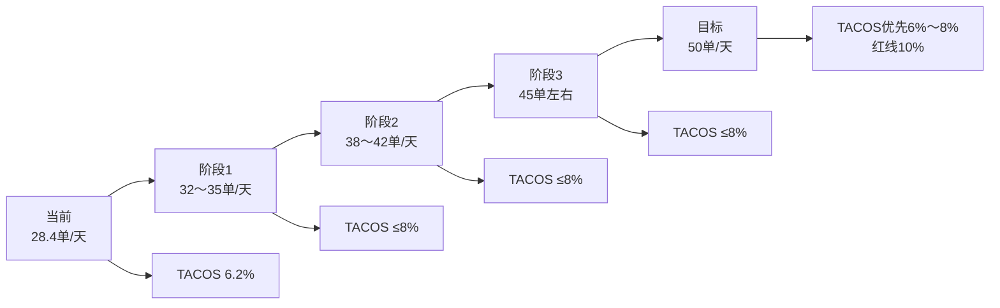
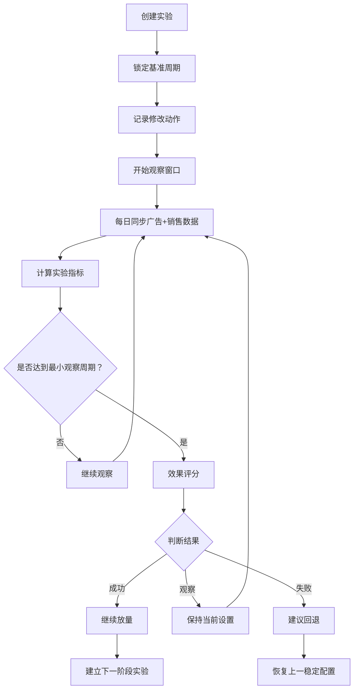
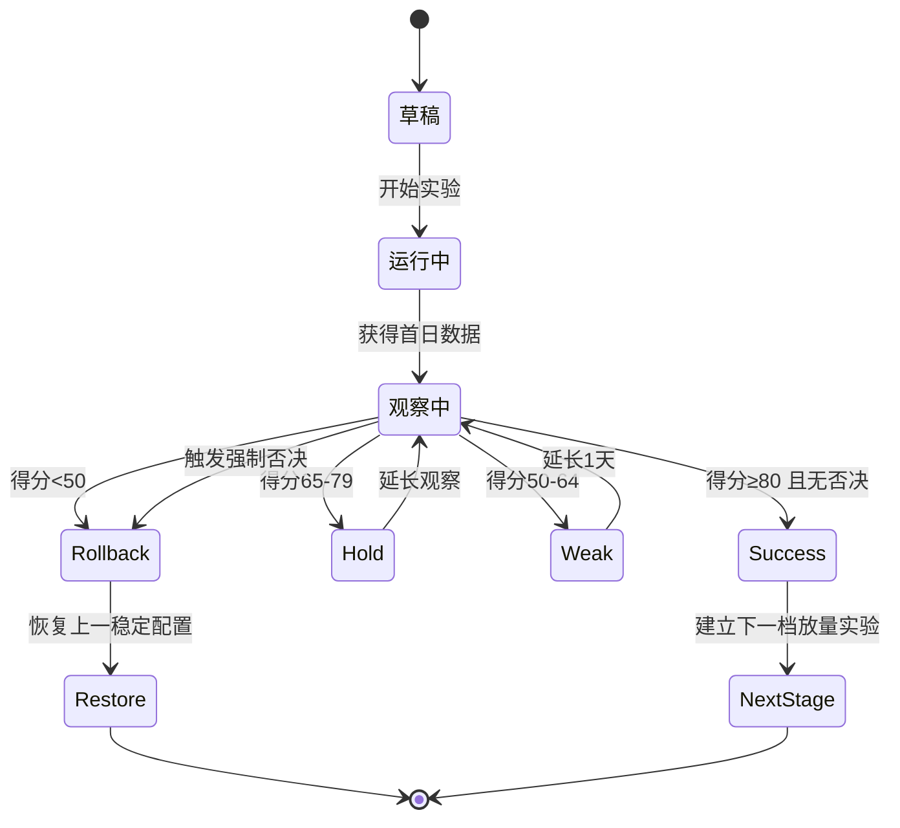
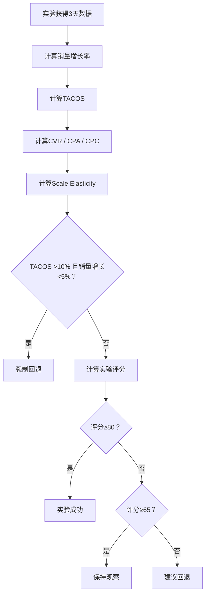

# GJYB001 广告结构调整复盘 + 50单目标 + 软件跟踪模块设计

> 系列：GJYB001  
> 当前目标：**50件/天**  
> TACOS 红线：**≤10%**  
> 推荐正常增长区：**6%～8% TACOS**  
> 数据基准周期：2026-08-31 ～ 2026-09-06  
> 数据源说明：源文件逐日广告与销售状态标记为 `partial`，因此软件必须把“缺失/不完整”与“0”严格区分。广告归因订单不等于总销量，禁止用 `totalUnits - adOrders` 直接推算自然销量。

---

# 1. 当前已修改的广告结构

根据当前广告后台：

| 变体 | 当前状态 | 当前预算 | 推广销售额 | 推广费用 | 推广费用份额 |
|---|---|---:|---:|---:|---:|
| YELLOW | 暂停 | 16,000 ₽ | 161,634 ₽ | 17,525.04 ₽ | 10.8% |
| RED | 已激活 | **20,000 ₽** | 86,136 ₽ | 8,858.17 ₽ | 10.3% |
| BLUE | 已激活 | **6,500 ₽** | 70,210 ₽ | 4,205.03 ₽ | 6.0% |
| GREEN | 已激活 | **4,000 ₽** | 55,220 ₽ | 4,917.91 ₽ | 8.9% |

---

# 2. 历史7天基准

系列历史7天汇总：

- 总销量：**199件**
- 日均销量：**28.4件/天**
- 总销售额：**557,612 ₽**
- 广告费：**34,546.94 ₽**
- TACOS：**6.20%**
- ACOS：**21.53%**
- CTR：**2.59%**
- CPC：**7.45 ₽**
- CVR：**1.23%**
- CPA：**606.09 ₽**

---

# 3. 当前广告结构是否合理

## 3.1 RED — 主力承接增量

当前设置：

```text
20,000 ₽
```

判断：

> **方向正确，但20k应该理解为预算上限，不应该要求一定花完。**

历史7天：

- CVR：1.59%
- CPA：449 ₽
- ACOS：15.97%
- ROAS：6.26

RED 是目前四个变体中：

- CVR最高
- CPA最低
- ACOS最低
- ROAS最高

因此：

```text
RED = 第一增长引擎
```

### RED 未来3天建议门槛

```text
CVR ≥ 1.5%
CPA ≤ 500 ₽
推广费用份额 ≤ 15%
总销量同步增长
```

如果满足：

```text
保持20k预算上限
```

如果明显恶化：

```text
回退至12k～15k区间
```

---

# 4. BLUE — 第二增长点

当前：

```text
6,500 ₽
```

当前推广费用份额：

```text
6.0%
```

判断：

> **当前结构合理，可以继续作为第二增长点测试。**

### BLUE观察目标

```text
CVR ≥ 1.2%
CPA ≤ 500～550 ₽
推广费用份额 ≤ 12%～15%
```

如果连续3天达标：

```text
6.5k → 8k
```

---

# 5. GREEN — 低预算观察款

当前：

```text
4,000 ₽
```

历史7天：

- CVR：0.57%
- CPA：1,224 ₽
- ACOS：44.2%

当前后台推广费用份额：

```text
8.9%
```

两套指标存在明显差异，因此：

> **不能仅凭当前后台费用份额判断GREEN已经改善。**

建议：

```text
4k继续测试2～3天
```

### GREEN验证条件

```text
CVR ≥ 1.0%
CPA明显下降
推广费用份额 ≤15%
总销量有实际贡献
```

如果继续：

```text
高点击
+
低转化
```

则：

```text
4k → 2.5k～3k
```

---

# 6. YELLOW — 暂停作为实验，而不是永久策略

YELLOW 历史销量最大，但新增流量边际效率下降。

当前：

```text
暂停
```

建议将本次暂停定义为：

```text
24～48小时实验
```

重点观察：

```text
暂停YELLOW以后
系列总销量是否明显下降？
```

---

## 情况A：销量基本不下降

例如：

```text
原来 28～30单/天
暂停后仍 27～30单/天
```

说明：

> 原YELLOW广告中存在较多低增量流量。

策略：

```text
继续暂停
或
低预算恢复
```

---

## 情况B：销量明显下降

例如：

```text
28～30单
↓
20～23单
```

说明：

> YELLOW仍然承担重要增量流量。

恢复：

```text
8k～12k/周
```

而不是直接恢复16k。

---

# 7. 第一阶段目标

当前：

```text
28.4单/天
```

不要直接要求：

```text
28 → 50
```

第一阶段先做到：

```text
32～35单/天
```

观察窗口：

```text
未来3个完整自然日
```

---

# 8. 第一阶段验收标准

| 指标 | 合格 | 优秀 | 回退/失败 |
|---|---:|---:|---:|
| 日均总销量 | ≥32 | ≥35 | <30 |
| TACOS | ≤8% | ≤7% | >10% |
| 系列CVR | ≥1.4% | ≥1.6% | <1.2% |
| CPA | ≤550 ₽ | ≤450 ₽ | >650 ₽ |
| CPC | ≤8.5 ₽ | ≤7.5 ₽ | >9.5 ₽ |
| 预算调整后销量增长 | ≥10% | ≥15% | <5% |

---

# 9. 目标爬坡路径



---

# 10. 预算增长原则

每次只增加：

```text
15%～20%
```

不要再使用接近翻倍的预算调整。

建议逻辑：

```text
当前结构稳定
↓
销量增长≥10%
↓
TACOS≤8%
↓
预算 +15%～20%
↓
再次观察2～3天
```

---

# 11. TACOS控制规则

## 正常增长区

```text
TACOS ≤8%
```

允许继续增加流量。

---

## 观察区

```text
8% < TACOS ≤10%
```

只有在：

```text
销量仍明显增长
```

的情况下允许短期存在。

---

## 强制停止区

```text
TACOS >10%
```

并且：

```text
销量增长 <5%
```

则：

```text
立即停止放量
回退上一稳定预算
```

---

# 12. 当前实验定义

本次操作应在软件中定义成：

```yaml
experiment_name: "GJYB001_预算重新分配_v1"

experiment_type: "portfolio_budget_reallocation"

baseline:
  daily_units: 28.43
  tacos: 6.20
  cvr: 1.23
  cpa: 606.09
  cpc: 7.45

changes:
  RED:
    action: "increase_budget"
    budget: 20000

  BLUE:
    action: "set_budget"
    budget: 6500

  GREEN:
    action: "set_budget"
    budget: 4000

  YELLOW:
    action: "pause"

observation_days: 3

stage_target:
  daily_units_min: 32
  daily_units_good: 35
  tacos_max: 8
```

---

# 13. 软件板块设计

# 模块名称

建议命名：

```text
广告优化实验中心
```

英文：

```text
Ad Optimization Experiment Center
```

它不只是“广告数据看板”。

核心职责是：

> **记录一次运营动作 → 自动跟踪调整后的效果 → 判断这次修改是否成功 → 决定继续、保持或回退。**

---

# 14. 软件模块总流程



---

# 15. 软件页面结构

建议界面分为6个主要区域。

---

## 区域A：实验状态卡

显示：

```text
实验名称
GJYB001_预算重新分配_v1

实验状态
观察中

开始时间
2026-09-07

观察窗口
3天

当前已观察
1/3天
```

状态：

```text
草稿
运行中
观察中
成功
保持
回退
终止
```

---

# 16. 区域B：目标进度

显示最核心目标：

```text
当前日均销量
28.4

阶段目标
32～35

最终目标
50
```

使用进度条：

```text
28.4 ███████████░░░░░░░░ 50
```

同时显示：

```text
距离阶段目标：
+3.6件/天

距离最终目标：
+21.6件/天
```

---

# 17. 区域C：核心KPI比较

布局：

| KPI | 调整前 | 当前 | 变化 | 目标 | 状态 |
|---|---:|---:|---:|---:|---|
| 日均销量 | 28.4 | 33.2 | +16.9% | ≥32 | 达标 |
| TACOS | 6.2% | 7.1% | +0.9pp | ≤8% | 达标 |
| CVR | 1.23% | 1.48% | +20.3% | ≥1.4% | 达标 |
| CPA | 606 ₽ | 510 ₽ | -15.8% | ≤550 ₽ | 达标 |
| CPC | 7.45 ₽ | 7.90 ₽ | +6.0% | ≤8.5 ₽ | 达标 |

状态颜色：

```text
绿色 = 达标
黄色 = 观察
红色 = 失败
灰色 = 数据不足
```

---

# 18. 区域D：SKU实验矩阵

每个SKU一张卡。

例如：

## RED

```text
当前预算：20,000 ₽

实验动作：
增加预算

历史CVR：
1.59%

当前CVR：
1.72%

CPA：
449 → 430 ₽

判断：
✅ 承接成功
```

---

## YELLOW

```text
状态：
暂停实验

暂停时间：
36小时

暂停前系列日均销量：
28.4

暂停后：
32.1

判断：
✅ 暂停未造成销量下降
```

---

# 19. 区域E：实验时间轴

```text
09-07 10:00
YELLOW暂停

09-07 10:05
RED预算调整到20k

09-07 10:05
BLUE预算调整到6.5k

09-07 10:05
GREEN预算调整到4k

09-08
第一天数据完成

09-09
第二天数据完成

09-10
自动生成实验结论
```

所有人工修改必须记录：

```text
操作人
修改前
修改后
时间
原因
备注
```

---

# 20. 区域F：AI决策卡

软件自动输出：

```text
当前实验结论：

预算重新分配有效。

原因：
1. 日均销量 +14%
2. TACOS 仍为7.4%
3. CVR提升至1.51%
4. CPA下降12%

建议：
进入下一阶段。

RED预算：
+15%

BLUE：
保持

YELLOW：
继续暂停24小时

GREEN：
降低至3k
```

---

# 21. 实验评分系统

建议总分：

```text
100分
```

组成：

| 指标 | 权重 |
|---|---:|
| 总销量增长 | 35 |
| TACOS | 25 |
| CVR变化 | 15 |
| CPA变化 | 10 |
| CPC变化 | 5 |
| 稳定性 | 10 |

---

# 22. 销量增长评分

```text
增长 ≥15%
= 35分

增长 10%～15%
= 30分

增长 5%～10%
= 20分

增长 0%～5%
= 10分

下降
= 0分
```

---

# 23. TACOS评分

```text
≤7%
= 25分

7%～8%
= 22分

8%～10%
= 15分

10%～12%
= 5分

>12%
= 0分
```

---

# 24. CVR评分

以实验前CVR为基准。

```text
提升 ≥20%
= 15分

提升 10%～20%
= 12分

变化 -10%～+10%
= 8分

下降10%～20%
= 4分

下降 >20%
= 0分
```

---

# 25. CPA评分

```text
下降 ≥20%
= 10分

下降 10%～20%
= 8分

变化 ±10%
= 5分

上涨10%～20%
= 2分

上涨 >20%
= 0分
```

---

# 26. 稳定性评分

观察最近3天：

```text
每天都达标
= 10分

2天达标
= 7分

1天达标
= 3分

全部未达标
= 0分
```

---

# 27. 最终实验评级

```text
≥80分
= 成功

65～79分
= 观察 / 保持

50～64分
= 弱有效

<50分
= 回退
```

但是存在强制否决条件。

---

# 28. 强制否决条件

即使评分高，只要出现以下任意情况：

```text
TACOS >10%
且销量增长 <5%
```

或者：

```text
连续2天销量明显下降
```

或者：

```text
CPA上涨 >30%
且订单没有增长
```

则：

```text
实验结论 = 回退
```

---

# 29. 软件状态机



---

# 30. 数据模型

建议数据库新增：

```text
ad_experiments
ad_experiment_skus
ad_experiment_events
ad_experiment_daily_metrics
ad_experiment_decisions
ad_stable_baselines
```

---

# 31. ad_experiments

```ts
interface AdExperiment {
  id: string;

  seriesId: string;

  name: string;

  type:
    | "budget_increase"
    | "budget_reallocation"
    | "price_test"
    | "pause_test"
    | "creative_test"
    | "mixed";

  status:
    | "draft"
    | "running"
    | "observing"
    | "success"
    | "hold"
    | "rollback"
    | "stopped";

  baselineStart: string;
  baselineEnd: string;

  startedAt: string;

  observationDays: number;

  targetDailyUnits: number;

  targetTacosMax: number;
}
```

---

# 32. ad_experiment_skus

```ts
interface ExperimentSku {
  experimentId: string;

  sku: string;

  action:
    | "increase_budget"
    | "reduce_budget"
    | "pause"
    | "resume"
    | "hold";

  beforeBudget: number | null;

  afterBudget: number | null;

  note?: string;
}
```

---

# 33. DailyMetric

```ts
interface ExperimentDailyMetric {
  experimentId: string;

  date: string;

  sku?: string;

  totalUnits: number | null;
  totalRevenue: number | null;

  adSpend: number | null;
  adOrders: number | null;
  adRevenue: number | null;

  impressions: number | null;
  clicks: number | null;

  ctr: number | null;
  cpc: number | null;
  cvr: number | null;
  cpa: number | null;

  acos: number | null;
  tacos: number | null;

  completeness:
    | "complete"
    | "partial"
    | "missing";
}
```

---

# 34. 实验关键公式

## 销量增长率

```text
SalesGrowth
=
CurrentDailyUnits / BaselineDailyUnits - 1
```

---

## 广告费增长率

```text
SpendGrowth
=
CurrentSpend / BaselineSpend - 1
```

---

## 边际销量效率

```text
MarginalUnitsPer1000Rub
=
新增销量 / 新增广告费 × 1000
```

---

## TACOS

```text
TACOS
=
广告费 / 总销售额 × 100%
```

---

## 放量弹性

```text
ScaleElasticity
=
销量增长率 / 广告费增长率
```

例如：

```text
广告费 +20%
销量 +15%

Elasticity
= 15% / 20%
= 0.75
```

建议：

```text
≥0.7 = 强
0.4～0.7 = 可接受
0.2～0.4 = 弱
<0.2 = 放量失效
```

---

# 35. 核心软件判断逻辑



---

# 36. 进度跟踪

最终目标：

```text
50单/天
```

软件显示：

```text
当前：
28.4

阶段目标：
35

最终：
50
```

完成度：

```text
28.4 / 50
≈56.8%
```

阶段完成：

```text
28.4 → 35
```

每完成一级自动生成：

```text
Stage 1 完成
↓
Stage 2 创建
```

---

# 37. 推荐的阶段模板

## Stage 0

```text
28～30单/天
```

目标：

```text
重新分配预算
```

---

## Stage 1

```text
32～35单/天
```

要求：

```text
TACOS ≤8%
```

---

## Stage 2

```text
38～42单/天
```

要求：

```text
TACOS ≤8%
```

---

## Stage 3

```text
45单/天
```

要求：

```text
TACOS ≤9%
```

---

## Stage 4

```text
50单/天
```

最终要求：

```text
TACOS ≤10%
```

推荐：

```text
6%～8%
```

---

# 38. 软件首页建议组件

```text
┌────────────────────────────────────────────────────────┐
│ GJYB001                             目标：50单/天      │
│ 当前：33.2单/天                     TACOS：7.1%         │
│ █████████████████░░░░░░░  66%                         │
└────────────────────────────────────────────────────────┘


┌──────────────┐
│ 当前实验     │
│ 预算重新分配 │
│ Day 2 / 3    │
│ 状态：观察中 │
└──────────────┘


┌──────────┬──────────┬──────────┬──────────┐
│ RED      │ YELLOW   │ BLUE     │ GREEN    │
│ ↑        │ PAUSE    │ →        │ ↓        │
│ 成功     │ 观察     │ 正常     │ 风险     │
└──────────┴──────────┴──────────┴──────────┘


┌────────────────────────────────────────────────────────┐
│ AI判断                                                   │
│ 当前实验评分：82                                         │
│ 结果：成功                                               │
│ 建议：RED +15%，其他保持                                 │
└────────────────────────────────────────────────────────┘
```

---

# 39. 模块最终目标

这个模块最终不是告诉运营：

```text
广告数据是多少
```

而是回答：

```text
我上次做的修改有效吗？
```

```text
为什么有效 / 为什么失败？
```

```text
应该继续加预算吗？
```

```text
应该保持多久？
```

```text
什么时候回退？
```

```text
距离50单目标还有多远？
```

这才是这个模块最核心的价值。

---

# 40. 当前本次实验的建议执行

```text
当前结构
↓
保持2～3个完整自然日
↓
不要再增加其他变量
↓
系统每日记录
销量 / TACOS / CVR / CPA / CPC
↓
第3天自动评分
```

如果：

```text
日均销量 ≥32
TACOS ≤8%
CVR ≥1.4%
CPA ≤550 ₽
```

则：

```text
实验成功
```

进入下一阶段：

```text
优先给RED增加15%预算
```

如果：

```text
日均销量 <30
或
TACOS >10%
或
CVR <1.2%
```

则：

```text
实验失败
↓
建议回退
```

---

# 41. 最终建议

> **当前广告结构适合作为一次“预算重新分配实验”，不要立即继续扩大整体预算。软件应把这次修改固定为一个实验版本，锁定修改前基线，然后用未来3个完整自然日对比销量、TACOS、CVR、CPA、CPC与预算弹性。只有在日均销量达到32～35单且TACOS≤8%时，才进入下一档放量。最终通过Stage 1 → Stage 2 → Stage 3 → Stage 4逐级达到50单/天，而不是一次性拉高预算。**
