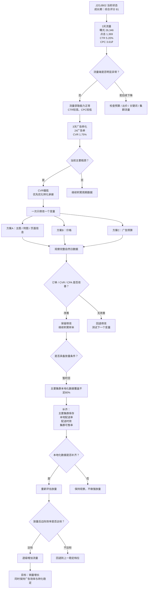
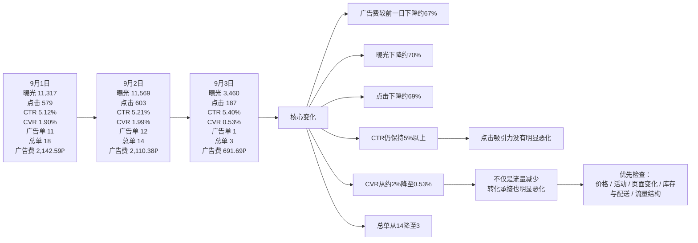
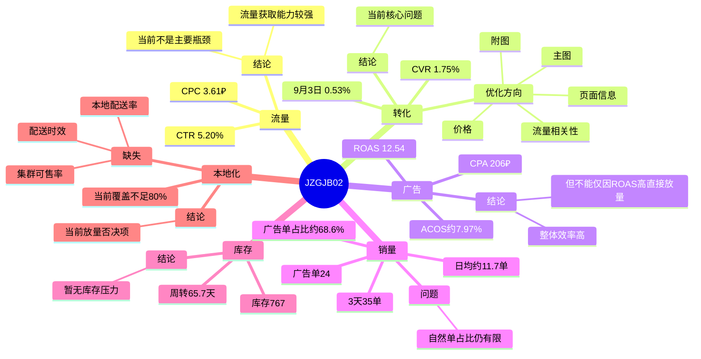
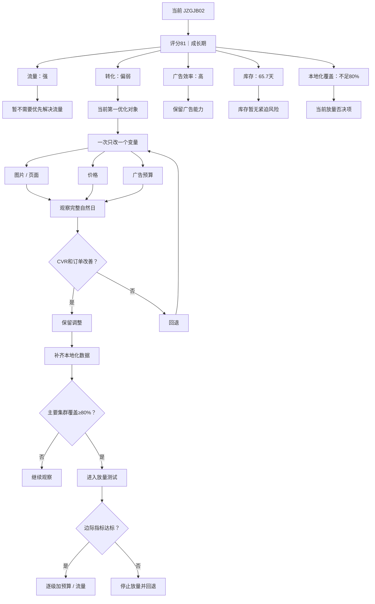

# Ozon 产品 JZGJB02 数据分析与运营决策导图

> 数据周期：2026-09-01 ～ 2026-09-03  
> SKU：2972605706  
> Offer ID：JZGJB02  
> 生命周期：成长期（30天窗口内）  
> 原则：仅依据原始数据分析，不补造缺失值；`null` 不视为 0。

---

## 一、核心结论

- **综合评分：81 / 良好**
- **流量端较强**：3天累计曝光 26,346，点击 1,369，CTR **5.20%**
- **CPC 较低**：**3.61₽**
- **当前主要瓶颈：CVR 偏低**，3天广告 CVR **1.75%**
- **广告效率整体较高**：广告花费 **4,944.66₽**，广告销售额 **62,027₽**，ROAS **12.54**
- **估算 ACOS ≈ 7.97%**
- **3天总销量：35单，日均约11.7单**
- **广告归因订单：24单，占总订单约68.6%**
- **库存：767件，库存周转约65.7天**
- **当前系统结论：暂不放量**
- **主要阻塞项：主要集群本地化数据覆盖不足80%**

### 一句话判断

> **JZGJB02 不是“没有流量”，而是“流量充足、点击优秀、转化偏弱”。现阶段应先改善转化承接和本地化覆盖，再决定是否逐级放量。**

---

## 二、主决策导图



---

## 三、9月1日—9月3日变化导图



---

## 四、关键数据看板

| 指标 | 3天周期数据 | 判断 |
|---|---:|---|
| 曝光 | 26,346 | 流量充足 |
| 点击 | 1,369 | 样本充足 |
| CTR | 5.20% | 点击承接强 |
| CPC | 3.61₽ | 点击成本较低 |
| 广告订单 | 24 | 有稳定成交 |
| 广告 CVR | 1.75% | **主要短板** |
| 广告花费 | 4,944.66₽ | — |
| 广告销售额 | 62,027₽ | — |
| ROAS | 12.54 | 广告效率高 |
| ACOS | ≈7.97% | 成本占比低 |
| 总订单 | 35 | 日均约11.7单 |
| 总销售额 | 94,234₽ | — |
| 广告单占总单 | ≈68.6% | 广告依赖偏高 |
| 库存 | 767 | — |
| 库存周转 | 65.7天 | 暂无断货压力 |
| 生命周期 | 成长期 | 可继续优化 |
| 本地化覆盖 | <80% | **当前放量否决项** |

---

## 五、数据异常与重点观察

### 9月3日不是单纯“广告少了”

9月2日 → 9月3日：

- 广告费：2,110.38₽ → 691.69₽
- 曝光：11,569 → 3,460
- 点击：603 → 187
- CTR：5.21% → 5.40%
- CVR：1.99% → 0.53%
- 广告单：12 → 1
- 总单：14 → 3

### 推断

广告费下降确实带来流量规模下降，但 **CTR没有恶化、CVR却明显下降**，所以订单下降不能只解释为预算减少。

需要检查：

1. 流量来源是否变化；
2. 价格 / 活动是否变化；
3. 页面图片或信息是否变化；
4. 库存 / 配送区域是否变化；
5. 广告归因口径是否变化。

### 归因口径差异

- 9月1日、9月2日：`SKU 明细曝光/点击/花费 + 唯一匹配活动级订单/销售额补齐`
- 9月3日：`SKU 明细或唯一活动名称匹配`

因此，9月3日与前两日的广告归因数据存在一定口径差异，不能只用单日广告订单判断产品真实转化变化。

---

## 六、问题树



---

## 七、当前建议动作

### 暂时不要

- 同时调整价格和广告预算；
- 同时修改图片和价格；
- 因ROAS高就立即大幅增加预算；
- 因9月3日销量下降就直接判断产品衰退。

### 应该做


---

## 八、放量停止条件

原始数据给出的停止条件：

1. 链接订单增长低于 **5%**
2. 边际 CPA 高于 **1,319₽**
3. 边际 ROAS 低于 **2.43**
4. 边际 CVR 低于基线的 **80%**
5. 主要集群库存覆盖低于 **21天**
6. 出现价格、促销、库存等第二变量

> 放量实验中，只要触发任意一个停止条件，就应该暂停继续增加流量，并回到上一稳定状态重新观察。

---

## 九、最终运营路径



---

## 十、软件可读取状态摘要

```yaml
sku: "2972605706"
offer_id: "JZGJB02"
lifecycle: "成长期"

overall:
  status: "良好"
  score: 81

traffic:
  status: "强"
  ctr: 5.1962
  cpc: 3.6119
  impressions: 26346
  clicks: 1369

conversion:
  status: "偏弱"
  cvr: 1.7531
  priority: "P0"

ads:
  status: "效率高但不建议直接放量"
  spend: 4944.66
  revenue: 62027
  roas: 12.5442
  acos_estimated: 7.97
  cpa: 206.03

sales:
  total_units: 35
  daily_average_units: 11.67
  ad_orders: 24
  ad_order_share_estimated: 68.57

inventory:
  stock: 767
  inventory_days: 65.74
  risk: "低"

localization:
  coverage: "<80%"
  status: "放量否决项"
  missing:
    - "本地配送率"
    - "配送时效"
    - "集群可售率"

next_action:
  - "一次只修改一个变量"
  - "优先改善CVR"
  - "补齐主要集群本地化数据"
  - "达到放量门槛后再逐级增加流量"
```
