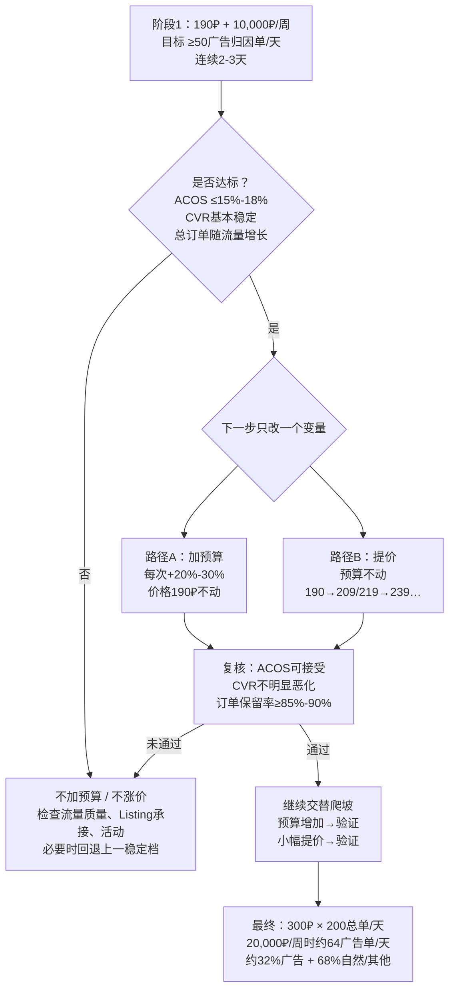

# Ozon新品：推流 × 提价 × 200单/天 决策图

> 核心原则：一次只改一个变量；先验证效率，再扩大流量；价格和预算交替爬坡。

## 当前起点
- 成交价：190₽
- 周广告预算：10,000₽
- 目标ACOS：15%
- 合格线：10,000 ÷ 15% ÷ 190 ÷ 7 ≈ **50个广告归因单/天**
- 最终目标：300₽ × 200总单/天

## 190₽固定价格时的预算门槛（ACOS=15%）

| 周广告预算 | 广告归因单/天合格线 |
|---:|---:|
| 10,000₽ | 50 |
| 12,000₽ | 60 |
| 15,000₽ | 75 |
| 18,000₽ | 90 |
| 20,000₽ | 100 |

## 最终稳态
- 300₽ × 200单/天 × 7天 = 420,000₽周GMV
- 20,000₽周广告费 → TACOS ≈ 4.76%
- ACOS 15% → 需要约64广告归因单/天
- 理想结构：约64广告单 + 136自然/其他单 = 200总单/天
