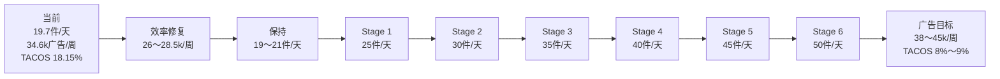
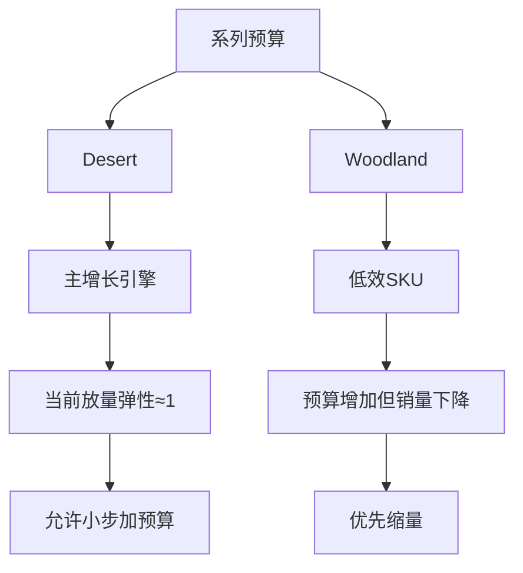
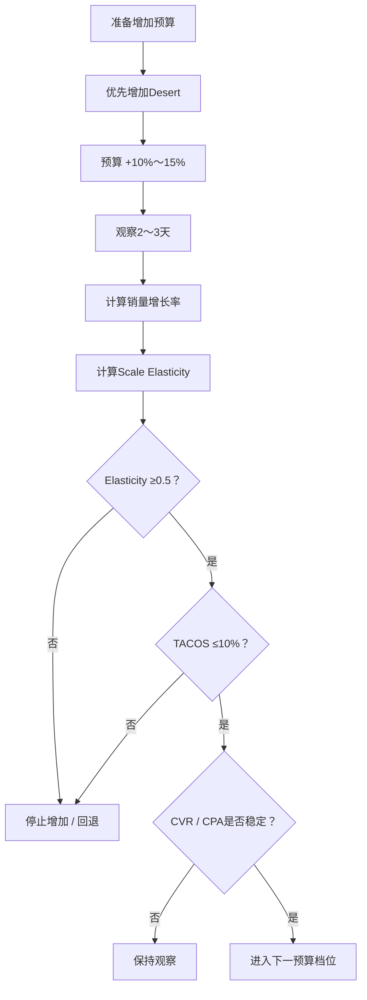

# 临时系列广告预算优化：保持销量并逐步冲刺50单/天

> 数据周期：2026-09-01 ～ 2026-09-07  
> 系列：临时系列  
> SKU：
> - WZW001-Woodland-3（2654732732）
> - WZW001-Desert Digital-3（2654734207）
>
> 目标：
> - 先在降低无效广告消耗的同时，尽量保持当前整体销量；
> - 后续逐级扩大有效预算；
> - 最终达到 **50件/天**；
> - TACOS 长期控制在 **10%以内**，优先目标 **8%～9%以内**。
>
> 数据质量说明：
> - 2026-09-07 广告报表未全部下载完成；
> - 2026-09-03 Woodland-3 的 `adOrders` 缺失；
> - 源文件部分广告/销售数据标记为 `partial`；
> - 缺失值不等于0；
> - 广告订单不等于总销量，禁止用 `totalUnits - adOrders` 推算自然销量。

---

# 1. 当前系列状态

## 1.1 7天整体数据

| 指标 | 当前值 |
|---|---:|
| 总销量 | **138件** |
| 日均销量 | **约19.7件/天** |
| 总销售额 | **190,546 ₽** |
| 广告花费 | **34,577.64 ₽** |
| TACOS | **18.15%** |
| 广告销售额 | **126,647 ₽** |
| ACOS | **27.30%** |
| CPC | **8.31 ₽** |
| CTR | **3.63%** |
| 参考CVR | **约2.14%** |
| 参考CPA | **约388.51 ₽** |

## 1.2 当前核心问题

> **目前广告投入相对于销售规模明显偏高。**

当前：

```text
日均销量 ≈19.7件
周广告费 ≈34.6k
TACOS ≈18.15%
```

如果目标要求：

```text
TACOS ≤10%
```

按照当前销售规模，理论允许的周广告费只有大约：

```text
190,546 × 10%
≈ 19,055 ₽
```

但是：

> **不建议直接从34.6k一次性砍到19k。**

因为目标不仅是降低TACOS，还要求：

```text
尽量保持销量不下降
```

正确策略是：

> **先砍低效SKU和低效边际流量，再观察销量是否能保持。**

---

# 2. 两个SKU表现差异

| SKU | 7天销量 | 日均销量 | 广告费 | TACOS | ACOS | CVR |
|---|---:|---:|---:|---:|---:|---:|
| Woodland-3 | 39 | 5.6 | 15,710.70 ₽ | **30.66%** | **68.67%** | ≈0.98%* |
| Desert Digital-3 | 99 | **14.1** | 18,866.94 ₽ | **13.54%** | **18.18%** | **3.07%** |

\* Woodland 存在一天 `adOrders` 缺失，因此CVR仅作为参考。

## 结论

```text
Desert Digital
= 当前主要增长引擎

Woodland
= 当前主要预算浪费点
```

---

# 3. 为什么Woodland应该先降预算

## 3.1 9/1～9/3

Woodland：

```text
广告费：
≈ 3,431 ₽

销量：
18件

日均：
6件
```

## 3.2 9/4～9/6

Woodland：

```text
广告费：
≈ 9,227 ₽

销量：
16件

日均：
≈5.3件
```

广告费增长：

```text
约 +169%
```

销量：

```text
反而下降
```

说明：

> **Woodland新增广告预算没有产生有效销量增量。**

其放量弹性已经接近：

```text
负值
```

因此：

```text
Woodland当前不适合继续扩广告。
```

---

# 4. 为什么Desert应该承担未来新增预算

## 4.1 9/1～9/3

Desert：

```text
广告费：
≈ 7,440 ₽

销量：
39件

日均：
13件
```

## 4.2 9/4～9/6

Desert：

```text
广告费：
≈ 8,559 ₽

销量：
45件

日均：
15件
```

广告费：

```text
约 +15%
```

销量：

```text
约 +15%
```

说明：

```text
Scale Elasticity ≈ 1.0
```

这是目前非常健康的放量表现。

因此：

> **未来新增广告预算应该优先给Desert。**

---

# 5. 第一阶段：先压低整体预算但保持销量

当前：

```text
总广告费：
≈34.6k/周
```

建议第一阶段：

| SKU | 当前7天广告费 | 建议目标 |
|---|---:|---:|
| Woodland | 15.7k | **7.5k～8.5k/周** |
| Desert | 18.9k | **18.5k～20k/周** |
| 合计 | 34.6k | **26k～28.5k/周** |

即：

```text
整体广告费先降低约18%～25%
```

但主要：

```text
只砍Woodland
```

Desert：

```text
基本保持
```

---

# 6. 推荐日预算

## Woodland

建议：

```text
约1,000～1,200 ₽/天
```

## Desert

建议：

```text
约2,700～2,900 ₽/天
```

## 系列整体

```text
约3,700～4,100 ₽/天
```

对应：

```text
≈26k～28.5k/周
```

---

# 7. 第一阶段目标

不要马上追50单。

第一阶段只验证：

> **预算降低以后，销量能不能保持。**

目标：

```text
日均销量：
19～21件/天
```

观察：

```text
3个完整自然日
```

期间：

- 不改价格；
- 不改图片；
- 不改活动；
- 不改Listing；
- 只改广告预算。

---

# 8. 第一阶段验收标准

| 指标 | 成功 | 观察 | 失败 |
|---|---:|---:|---:|
| 总销量 | **≥19件/天** | 18～19 | <18 |
| TACOS | **≤15%** | 15%～17% | >17% |
| Desert日销量 | **≥14** | 12～14 | <12 |
| Desert CVR | **≥3%** | 2.5%～3% | <2.5% |
| Woodland日销量 | ≥5 | 4～5 | <4 |

如果：

```text
广告费下降约20%
但销量仍保持19～21件/天
```

则：

> **第一阶段实验成功。**

---

# 9. 为什么不能直接砍到19k

理论上：

```text
当前销售额 ×10%
≈19k广告费
```

但直接砍到19k存在：

```text
销量同步下降
```

风险。

因此应该：

```text
34.6k
↓
26～28.5k
↓
验证销量
↓
再决定是否进一步压缩
```

这是一种：

> **分层找最低有效预算的方法。**

---

# 10. 日销量与TACOS 10%预算红线

当前平均每件销售额：

```text
190,546 ÷ 138
≈1,381 ₽/件
```

假设客单结构基本不变：

| 日销量 | 周GMV约 | TACOS 10%最大周广告费 | 推荐8%广告费 |
|---:|---:|---:|---:|
| 20 | 193k ₽ | **19.3k ₽** | 15.5k ₽ |
| 25 | 242k ₽ | **24.2k ₽** | 19.3k ₽ |
| 30 | 290k ₽ | **29.0k ₽** | 23.2k ₽ |
| 35 | 338k ₽ | **33.8k ₽** | 27.1k ₽ |
| 40 | 387k ₽ | **38.7k ₽** | 30.9k ₽ |
| 45 | 435k ₽ | **43.5k ₽** | 34.8k ₽ |
| **50** | **483k ₽** | **48.3k ₽** | **38.7k ₽** |

---

# 11. 这张表说明了什么

现在：

```text
19.7件/天
广告费34.6k/周
```

而：

```text
50件/天
TACOS 10%
最大广告费≈48.3k/周
```

也就是说：

销量需要：

```text
约 +154%
```

但广告费最多只能：

```text
约 +40%
```

因此：

> **50单/天绝对不能单纯依靠继续堆预算实现。**

还必须依赖：

- CVR提升；
- 高效率SKU占比提升；
- 自然流量增长；
- 搜索排名增长；
- Listing承接能力提升；
- 价格与活动结构优化。

---

# 12. 后续放量路径

建议阶段：

```text
20单
↓
25单
↓
30单
↓
35单
↓
40单
↓
45单
↓
50单
```

不要：

```text
20 → 50
```

一步完成。

---

# 13. Stage 0：效率修复

目标：

```text
19～21件/天
```

广告：

```text
26～28.5k/周
```

任务：

```text
砍掉Woodland低效预算
+
保持Desert有效预算
```

---

# 14. Stage 1：25单/天

目标：

```text
25件/天
```

理论TACOS 10%广告上限：

```text
≈24.2k/周
```

这一阶段重点不是扩大总广告，而是：

- Desert增加有效流量；
- 提高CVR；
- 提高自然流量；
- 压低Woodland浪费。

---

# 15. Stage 2：30单/天

目标：

```text
30件/天
```

TACOS 10%广告上限：

```text
≈29k/周
```

推荐广告：

```text
23～27k/周
```

---

# 16. Stage 3：35单/天

目标：

```text
35件/天
```

最大广告费：

```text
≈33.8k/周
```

推荐：

```text
27～31k/周
```

---

# 17. Stage 4：40单/天

目标：

```text
40件/天
```

最大广告费：

```text
≈38.7k/周
```

推荐：

```text
31～35k/周
```

---

# 18. Stage 5：45单/天

目标：

```text
45件/天
```

最大广告费：

```text
≈43.5k/周
```

推荐：

```text
35～40k/周
```

---

# 19. Stage 6：50单/天

最终：

```text
50件/天
```

TACOS 10%广告费红线：

```text
≈48.3k/周
```

推荐目标：

```text
38～45k/周
```

对应：

```text
TACOS约8%～9%
```

---

# 20. 完整增长路径图



---

# 21. Desert的预算爬坡方式

当前：

```text
约19k/周
```

建议未来：

```text
19k
↓
21k
↓
23k
↓
25k
```

每次：

```text
+10%～15%
```

观察：

```text
2～3个完整自然日
```

---

# 22. Desert继续放量条件

建议：

```text
CVR ≥3%
```

```text
CPA ≤300～350 ₽
```

```text
ACOS ≤20%
```

最重要：

```text
总销量必须同步增长
```

如果：

```text
预算 +15%
销量 +12%～15%
```

说明：

```text
放量有效
```

继续。

如果：

```text
预算 +15%
销量只 +2%
```

说明：

```text
边际流量失效
```

停止加预算。

---

# 23. Woodland什么时候允许重新加预算

现在：

```text
不建议
```

只有满足：

```text
CVR稳定 ≥1.5%
```

或：

```text
CPA明显下降
```

并且：

```text
低预算状态销量仍增长
```

才允许：

```text
8k
↓
9k
↓
10k
```

否则：

```text
长期维持低预算
```

---

# 24. 放量弹性

定义：

```text
Scale Elasticity
=
销量增长率 ÷ 广告费增长率
```

例如：

```text
预算 +15%
销量 +15%

Elasticity = 1.0
```

---

# 25. 放量弹性评价标准

| Elasticity | 判断 |
|---:|---|
| ≥0.8 | **非常好，继续放量** |
| 0.5～0.8 | 可以继续 |
| 0.3～0.5 | 保持观察 |
| <0.3 | 停止增加 |
| ≤0 | **回退** |

---

# 26. 当前两个SKU的放量角色



---

# 27. 整体预算扩张规则

未来整体预算不能先于销量增长。

正确顺序：

```text
销量先达到下一阶段
↓
销售额提高
↓
TACOS允许预算上限提高
↓
再增加预算
```

不是：

```text
先加预算
↓
期待销量自己追上
```

---

# 28. 放量决策树



---

# 29. TACOS规则

## 正常增长区

```text
TACOS ≤8%
```

允许继续放量。

## 观察区

```text
8%～10%
```

只有：

```text
销量仍明显增长
```

时允许短期存在。

## 强制停止区

```text
TACOS >10%
```

并且：

```text
销量增长 <5%
```

则：

```text
停止放量
回退预算
```

---

# 30. 软件模块建议新增的指标

你之前设计的「广告优化实验中心」建议加入以下字段：

```yaml
budget_efficiency:
  scale_elasticity: null
  marginal_units_per_1000_rub: null
  marginal_cpa: null
  marginal_roas: null

budget_ceiling:
  based_on_tacos_10: null
  based_on_tacos_8: null

sku_role:
  Desert: "growth_engine"
  Woodland: "efficiency_repair"
```

---

# 31. 软件自动判断逻辑

```text
IF
SKU预算增长 >10%

AND
销量增长 >= 预算增长 ×0.5

AND
TACOS <=10%

THEN
允许继续放量
```

---

如果：

```text
销量增长 <5%
```

则：

```text
保持或回退
```

---

如果：

```text
预算增长
但销量下降
```

则：

```text
立即回退
```

---

# 32. 当前真实执行方案

## Step 1

未来3天：

Woodland：

```text
1,000～1,200 ₽/天
```

Desert：

```text
2,700～2,900 ₽/天
```

系列：

```text
3,700～4,100 ₽/天
```

---

## Step 2

目标：

```text
保持19～21件/天
```

同时：

```text
TACOS下降
```

---

## Step 3

如果成功：

下一步：

```text
只增加Desert
```

增加：

```text
10%～15%
```

---

## Step 4

再次观察：

```text
2～3天
```

计算：

- 销量增长；
- Spend Growth；
- Scale Elasticity；
- TACOS；
- CVR；
- CPA。

---

# 33. 最终目标状态

```text
50件/天
```

推荐：

```text
周广告费：
38k～45k
```

推荐：

```text
TACOS：
8%～9%
```

上限：

```text
10%
```

---

# 34. 核心结论

> **当前最重要的不是继续增加广告，而是先解决“34.6k周广告费为什么只能支撑约20件/天”的效率问题。数据已经明确显示：Woodland在大量吞噬无效预算，而Desert仍然具有良好的放量弹性。因此，第一步应把整体广告费从约34.6k降到26～28.5k，主要削减Woodland，同时保持Desert。只要日销量仍能保持19～21件，就说明已经成功找到更健康的预算底盘。后续所有新增预算都优先给Desert，并以10%～15%的幅度逐级测试，直到25 → 30 → 35 → 40 → 45 → 50件/天。最终50件/天时，推荐周广告费约38～45k，TACOS维持8%～9%，而不是卡在10%红线上。**

---

# 35. 软件可读取策略摘要

```yaml
series: "temporary_series"

period:
  from: "2026-09-01"
  to: "2026-09-07"

current:
  total_units: 138
  daily_units: 19.71
  total_revenue: 190546
  weekly_ad_spend: 34577.64
  tacos: 18.1466

sku_strategy:

  Woodland:
    role: "efficiency_repair"
    current_weekly_spend: 15710.70
    recommended_weekly_spend_min: 7500
    recommended_weekly_spend_max: 8500
    recommended_daily_spend_min: 1000
    recommended_daily_spend_max: 1200
    action: "reduce"

  Desert:
    role: "growth_engine"
    current_weekly_spend: 18866.94
    recommended_weekly_spend_min: 18500
    recommended_weekly_spend_max: 20000
    recommended_daily_spend_min: 2700
    recommended_daily_spend_max: 2900
    action: "hold_then_scale"

stage_0:
  target_daily_units_min: 19
  target_daily_units_max: 21
  weekly_budget_min: 26000
  weekly_budget_max: 28500
  observation_days: 3

scale_rules:
  budget_step_pct_min: 10
  budget_step_pct_max: 15
  elasticity_continue_min: 0.5
  elasticity_strong_min: 0.8
  tacos_hard_limit: 10

final_target:
  daily_units: 50
  recommended_weekly_ad_spend_min: 38000
  recommended_weekly_ad_spend_max: 45000
  recommended_tacos_min: 8
  recommended_tacos_max: 9
  hard_tacos_limit: 10
```
